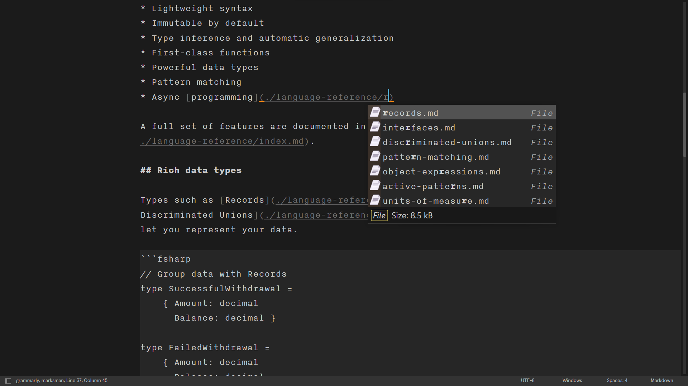
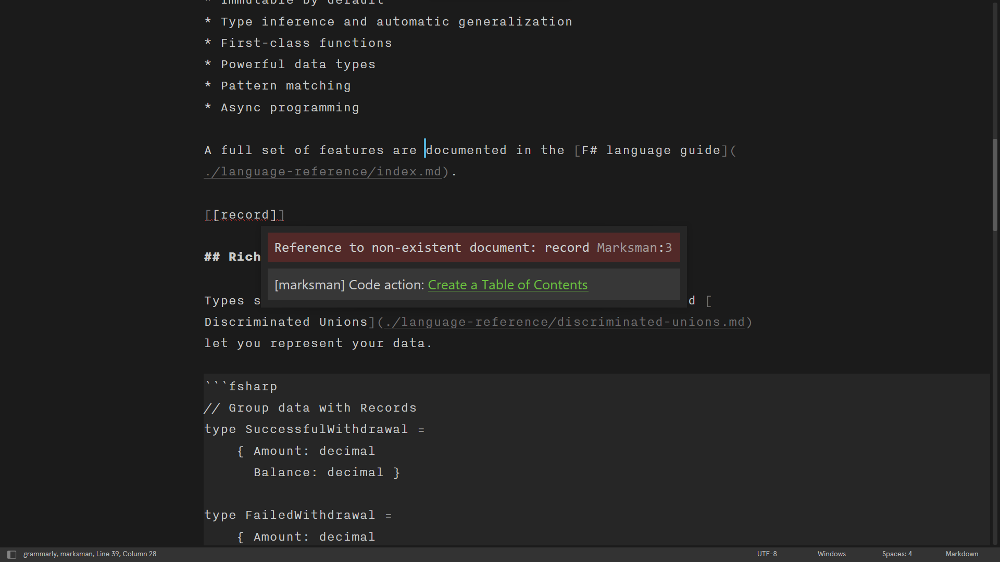
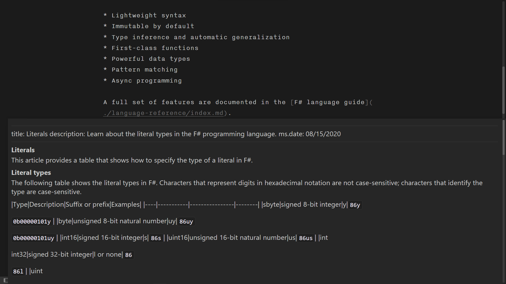
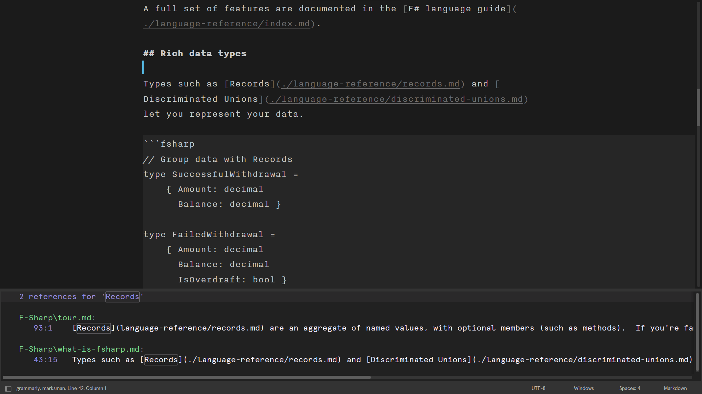

# LSP-marksman

An LSP server for Markdown that provides completion, go to definition, find references, diagnostics, etc. It also supports wiki-link-style references that enable Zettelkasten-like, note-taking.

Provided through [Marksman](https://github.com/artempyanykh/marksman).

### Requirements

Install [LSP](https://packagecontrol.io/packages/LSP) via Package Control.

### Installation

Currently, LSP-marksman is not on Package Control.

1. Clone LSP-marksman to your `Packages` folder.
    1. Run `sublime.packages_path()` in Sublime Text console. It will show the path of your `Packages` folder.
    1. Open a terminal in the `Packages` folder and then run `git clone git@github.com:bitsper2nd/LSP-marksman.git`
1. Restart Sublime Text.

OR

1. Press Control + Shift + p in Sublime Text to open the command palette.
1. Type Add Repository `https://github.com/bitsper2nd/LSP-marksman.git`
1. Open the command palette again and type install package. Type LSP-marksman and press Enter.

### Screenshots

A selection of screenshots of the marksman features demonstrated for Sublime Text.

Completions

Errors

Hover

References

### Configuration

There are some ways to configure the package and the language server.

- From `Preferences > Package Settings > LSP > Servers > LSP-marksman`
- From the command palette `Preferences: LSP-marksman Settings`

### Acknowledgments
- Thank you [Artem Pyanykh](https://github.com/artempyanykh) for making this language server
- Thank you [Terminal](https://github.com/TheSecEng) for helping me with this plugin
